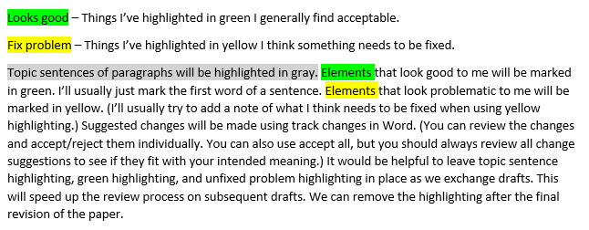

# Reviewing Writing

This is some information about what I'm usually looking for when reviewing student academic writing.

### Here are the things I’m looking for: 

* Section Content (appropriate and complete)
* Evidence (citations used when summarizing, paraphrasing, or quoting)
* APA (spelling, grammar, headings, citation formatting, reference formatting, tables, figures, appendices)
* Logic and Flow (well-formed paragraphs, topic sentences, suitable transitions, logical arrangement, clearly written sentences)

### Highlighting:

### Track Changes and comments in Word:

* This link explains how to use [Track Changes in Word](https://support.microsoft.com/en-us/office/track-changes-in-word-197ba630-0f5f-4a8e-9a77-3712475e806a).
* This link explains how to use [Comments in Word](https://support.microsoft.com/en-us/office/insert-or-delete-a-comment-8d3f868a-867e-4df2-8c68-bf96671641e2).

# General Suggestions for Improving Writing

* I always recommend the use of Grammarly. Graduate students at the U of U have free access. https://gradschool.utah.edu/resources-hub/grammarly/index.php 
* (new in 2023) ChatGPT (https://openai.com/blog/chatgpt/) can also help fix problem sentences and more. Here are some [examples](https://github.com/cmcntsh/UseChatGPtEdit) of things I've tried.
* (new in 2023) APA has come out with guidance on citing ChatGPT https://apastyle.apa.org/blog/how-to-cite-chatgpt
* The [Graduate Student Writing Center](https://writingcenter.utah.edu/) is a good resource.
* Understand that writing is an iterative process. Be prepared to complete assignments, receive feedback, and incorporate feedback into revisions.
* You may find it helpful to work on writing assignments in steps.
  * Find relevant content.
  * Group content into logical categories according to the needs of your project.
  * Order your content in a logical sequence according to the needs of your project.
  * Write a rough draft narrative.
  * Work on flow and logic.
  * Edit for publication requirements. (length, style, etc.)

### Paragraphs

* A lot of final refinement work will consist of evaluating and refining the content and order of your paragraphs.
  * Here are some nice articles on what you should understand about the purpose of paragraphs and how to structure paragraphs.
    * [The Ultimate Guide to Paragraphs](https://www.grammarly.com/blog/paragraphs/) (Ellis, 2021a)
    * [How to Write Strong Paragraphs](https://www.grammarly.com/blog/paragraph-structure/) (Ellis, 2022)
    * [On Paragraphs](https://owl.purdue.edu/owl/general_writing/academic_writing/paragraphs_and_paragraphing/index.html) (Purdue Online Writing Lab, 2022a)
    * "You may have learned that every paragraph should begin with a topic sentence and be directly relevant to the section in which it appears. Those are good rules of thumb, but applied too strictly they can make your writing seem stiff. The important thing is to structure and arrange your paragraphs so that they lead your readers through the conversation you are orchestrating. Open each paragraph with a sentence or two that signal its key concepts. Doing that will help readers better understand what follows. If your opening doesn't also state the paragraph's point, then your last sentence should. Never bury the point in the middle." (Booth et al, 2016, p. 195)
    * "There is no minimum or maximum sentence length in APA Style. Overuse of short, simple sentences produces choppy prose, however, and overuse of long, involved sentences results in difficult, sometimes incomprehensible, language. Varied sentence length helps readers maintain interest and comprehension. When involved concepts require long sentences, the components should proceed logically. Avoid including multiple ideas in a single sentence; instead, break the sentence into shorter ones. Direct, declarative sentences with simple, common words are usually best.
Similar cautions apply to paragraph length. Single-sentence paragraphs are abrupt and should be used infrequently. Paragraphs that are too long (i.e., longer than one double-spaced manuscript page) risk losing readers' attention. A new paragraph signals a shift to a new idea and provides a pause for readers - a chance to assimilate one step in the conceptual development before beginning another. Look for a logical place (or places) to break up a long paragraph or reorganize the material." (American Psychological Association, 2020, p. 115)
  * One exercise you can use to evaluate the quality of your paragraphs and the sequence of your logic is called Reverse Outlining.
    * [Reverse Outlining: An Exercise for Taking Notes and Revising Your Work](https://owl.purdue.edu/owl/general_writing/the_writing_process/reverse_outlining.html) (Purdue Online Writing Lab, n.d.)
    * [Reverse Outlines: A Writer's Technique for Examining Organization](https://writing.wisc.edu/handbook/process/reverseoutlines/) (The Writing Center, n.d.)
    
### Sentences
    
* This work will also consist of evaluating and refining your sentences.
  * [How to Write Better Sentences](https://www.grammarly.com/blog/sentences/) (Ellis, 2021b)
  * [How to Write Excellent Sentences: A Guide to Sentences Structure](https://blog.streetwriters.co/how-to-write-good-sentences/) (Streetwriters, 2021)
  * (new in 2023) ChatGPT (https://openai.com/blog/chatgpt/) can also help fix problem sentences.
 
### Stylistic Choices, Reader Interpretation, Nuanced Writing

* I attended a presentation by a professor of rhetoric named George Gopen in 2023, where I was introduced to the Reader Expectation Approach to writing. The gist of his method is that the writer needs to consider how readers of English prose usually interpret the meaning of sentences and write so readers are more likely to interpret the intended meaning of a work. Dr. Gopen has published a number of writings, but I **HIGHLY** recommend his series of articles on litigation. (Available at https://www.georgegopen.com/litigation-articles.html) Most of the articles are 1-2 pages long. In them he describes how to structure writing to facilitate reader interpretation of the intended meaning. He answers such questions as: When should passive voice be used? When is a sentence too long or too short? How to reinforce key points?And how to write for clarity and ease of reading? (You may wonder what articles on litigation have to do with scientific or academic writing. The answer is scientific and academic writing is usually about making an argument and supporting it with evidence. If you read the articles, you will see they are very relevant.)

#### Reader Expectation Approach

* Arrange information according to reader expectations (Lingard, 2022).
* [Writing for the reader: Using reader expectation principles to maximize clarity](https://link.springer.com/article/10.1007/s40037-022-00708-w#:~:text=clarity%20and%20flow.-,The%20reader%20expectation%20approach,put%E2%80%9D%20%5B2%2C%20p.)
* https://www.georgegopen.net/
* Any sentence should address the following questions:
  * What is going on?
  * Who's story is it?
  * How does this sentence connect with the preceding sentence?
  * Which words should be emphasized in the sentence?
    
### Professional Voice

* [Tone in Business Writing](https://owl.purdue.edu/owl/subject_specific_writing/professional_technical_writing/tone_in_business_writing.html) (Purdue Online Writing Lab, 2022)
* [How to Make Writing Sound More Professional](https://www.grammarly.com/business/learn/how-to-make-your-writing-sound-more-professional/) (Grammarly Business, 2021)

### Working with References

* If you are citing more than a handful of sources in your writing, I recommend using a citation manager. If you're a student at the University of Utah, EndNote is available for a reasonable cost from the [Office of Software Licensing](https://software-catalog.app.utah.edu/product/1076).
* Zotero is available for free. It has some nice integration with web browsers and allows you to share references with groups. https://www.zotero.org/
  * How to use Zotero (A complete beginner's guide) (13 min) https://www.youtube.com/watch?v=JG7Uq_JFDzE
* If you're citing other sources in your writing, you need to come up with a system to keep track of your notes and material you use from your references. Here is a demonstration of keeping source notes using [Miro](https://miro.com/). https://youtu.be/jnGM-j52Rss
* I recommend purchasing the most current APA manual. As of 2023 that is APA 7 (American Psychological Association, 2020). However, many things can be looked up online on the APA Style Blog https://apastyle.apa.org/
* Searching for Literature https://github.com/cmcntsh/LitSearchAIResources

### Genre resources

* A genre is a set of forms or standards expected by a community (Booth et. al., 2016). The genre we focus on in much of academic writing in nursing is the research report with five sections: Introduction, Methods, Results, Discussion, and Conclusion (Booth et. al., 2016).
* Much quality improvement reporting follows an even more specific standard called Revised Standards for Quality Improvement Reporting Excellence or SQUIRE 2.0 guidelines (Ogrinc et. al., 2015). SQUIRE 2.0 follows a slightly shorter version of the five part research report called Introduction, Methods, Results, and Discussion (IMRAD). http://www.squire-statement.org/index.cfm?fuseaction=Page.ViewPage&PageID=471

### Publishing

* Publishing quality improvement https://qsen.org/wp-content/uploads/2015/06/Getting-your-work-published-Demystifying-the-SQUIR.pptx
* Writing publishable work https://nursing.duke.edu/sites/default/files/oermann_christenbery_turner_writing_reviews_res_qi_ebp.pdf

# References

* American Psychological Association. (2020). Publication manual of the American Psychological Association (Seventh ed.). https://doi.org/10.1037/0000165-000 
* Booth, W. C., Colomb, G. G., Williams, J. M., Bizup, J., & Fitzgerald, W. T. (2016). The craft of research (Fourth ed.). University of Chicago Press. https://doi.org/10.7208/chicago/9780226239873.001.0001
* Ellis, M. (2021a). The ultimate guide to paragraphs. Grammarly, Inc. Retrieved November 18 from https://www.grammarly.com/blog/paragraphs/
* Ellis, M. (2021b). How to write better sentences. Grammarly, Inc. Retrieved November 18 from https://www.grammarly.com/blog/sentences/
* Ellis, M. (2022, June 2, 2022). How to write strong paragraphs. Grammarly, Inc. Retrieved November 18 from https://www.grammarly.com/blog/paragraph-structure/
* Grammarly Business (2021). How to make writing sound more professional. Retrieved February 7, 2023 from https://www.grammarly.com/business/learn/how-to-make-your-writing-sound-more-professional/
* Lingard, L. (2022). Writing for the reader: Using reader expectation principles to maximize clarity. Perspectives on Medical Education, 11(4), 228–231. https://doi.org/10.1007/S40037-022-00708-W
* Ogrinc, G., Davies, L., Goodman, D., Batalden, P., Davidoff, F., & Stevens, D. (2015). SQUIRE 2.0 (S tandards for QU ality I mprovement R eporting E xcellence): Revised publication guidelines from a detailed consensus process. The Journal of Continuing Education in Nursing, 46(11), 501-507. http://www.squire-statement.org/index.cfm?fuseaction=Page.ViewPage&PageID=471 
* Purdue Online Writing Lab. (n.d.). Reverse outlining: An exercise for taking notes and revising your work. Purdue University. Retrieved November 18, 2022 from https://owl.purdue.edu/owl/general_writing/the_writing_process/reverse_outlining.html
* Purdue Online Writing Lab. (2022a). On Paragraphs. Purdue University. Retrieved January 25, 2023 from https://owl.purdue.edu/owl/general_writing/academic_writing/paragraphs_and_paragraphing/index.html
* Purdue Online Writing Lab. (2022b). Tone in business writing. Retrieved February 7, 2023 from https://owl.purdue.edu/owl/subject_specific_writing/professional_technical_writing/tone_in_business_writing.html
* Streetwriters. (2021, March 15, 2021). How to write excellent sentences: A guide to sentences structure. Streetwriters LLC. Retrieved November 18, 2022 from https://blog.streetwriters.co/how-to-write-good-sentences/
* The Writing Center. (n.d.). Reverse outlines: A writer's technique for examing organization. University of Wisconsin - Madison. Retrieved November 18, 2022 from https://writing.wisc.edu/handbook/process/reverseoutlines/ 
